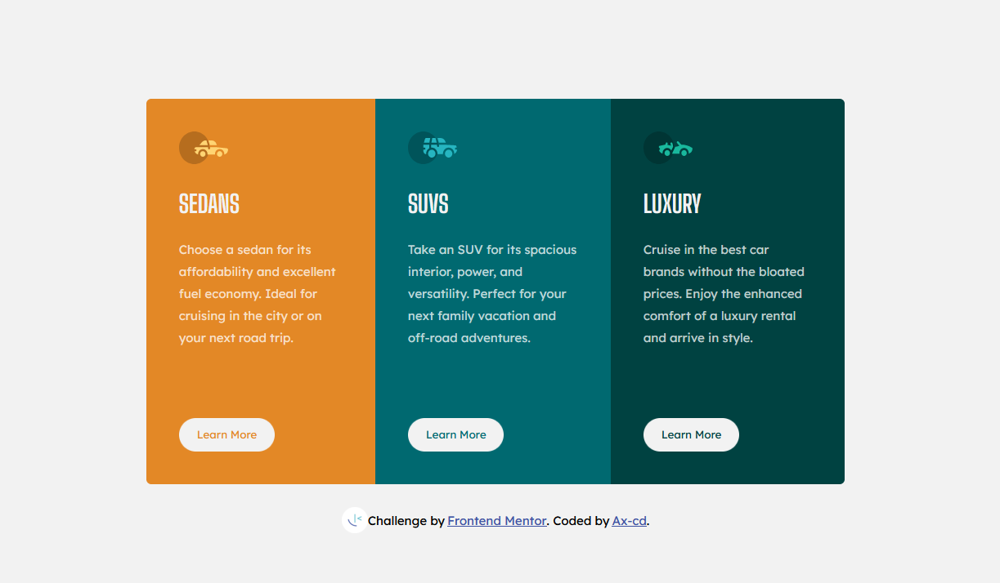

# Frontend Mentor - 3-column preview card component solution

This is a solution to the [3-column preview card component challenge on Frontend Mentor](https://www.frontendmentor.io/challenges/3column-preview-card-component-pH92eAR2-). Frontend Mentor challenges help you improve your coding skills by building realistic projects. 

## Table of contents

- [Overview](#overview)
  - [The challenge](#the-challenge)
  - [Screenshot](#screenshot)
  - [Links](#links)
- [My process](#my-process)
  - [Built with](#built-with)
  - [What I learned](#what-i-learned)
  - [Continued development](#continued-development)
  - [Useful resources](#useful-resources)
- [Author](#author)


## Overview

### The challenge

Users should be able to:

- View the optimal layout depending on their device's screen size
- See hover states for interactive elements

### Screenshot




### Links

- Solution URL: [Frontend Mentor](https://www.frontendmentor.io/solutions/3column-preview-card-using-a-mobilefirst-workflow-0GFcpfemY)
- Live Site URL: [GitHub Page](https://ax-cd.github.io/3-column-preview-card-challenge/)


## My process

### Built with

- Semantic HTML5 markup
- CSS custom properties
- Flexbox
- Mobile-first workflow


### What I learned

With this project I got more comfortable using media queries and I learned that it was easier to start with a "mobile-first workflow" and then add on needed values to style for larger screens.
I also started using relative units instead absolute, and found it easier to create responsive elements.

```css
main {
    max-width: 90%;
}
@media (min-width: 37.5em) {
    main {
    max-width: 60%;
    min-height: 20%;
    display: flex;
    }
}
```

### Continued development
- Be completely comfortable using relative units and media queries.

### Useful resources

- ["Are you using the right CSS units?" by Kevin Powell](https://www.youtube.com/watch?v=N5wpD9Ov_To) - This video helped me understand which units were best to use for differents CSS elements, and how using relative units instead of fixed units is better for accessibility.
- ["How to write media queries in CSS" by Coder Coder](https://www.youtube.com/watch?v=IsC5-C_nuF4) - This video was enlightening in how to best use media queries when writing CSS.


## Author

- Website - [Ax-coding](https://axcoding.blogspot.com/)
- Frontend Mentor - [@Ax-cd](https://www.frontendmentor.io/profile/Ax-cd)
- Instagram - [@ax.coding](https://www.instagram.com/ax.coding/)
